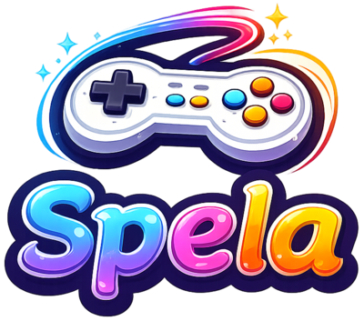
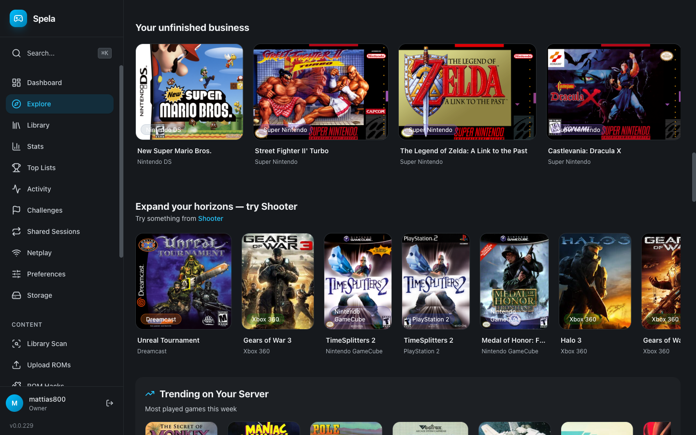
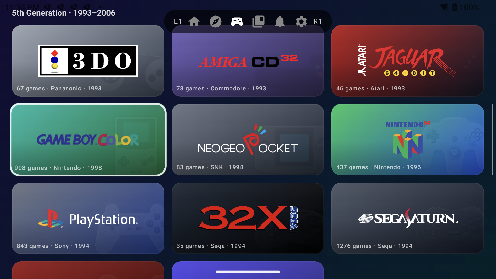
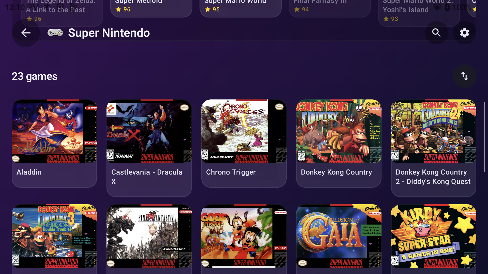
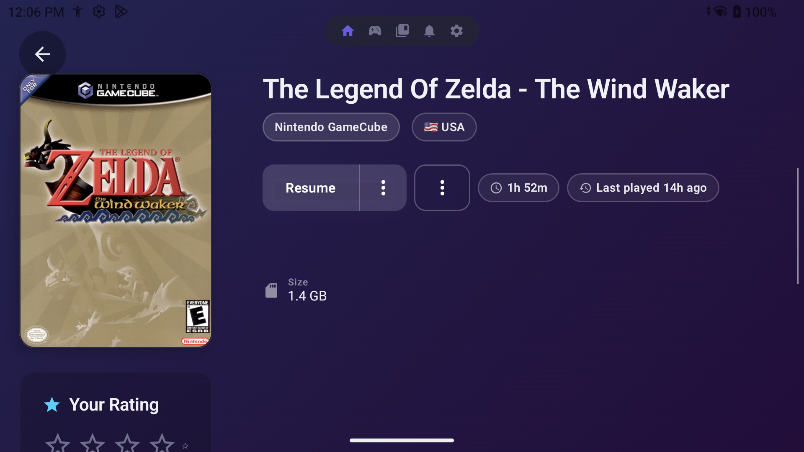

<p align="center">
  
</p>
<p align="center"><em>Nu spelar vi!</em> — Your retro game library, self-hosted. Play anywhere.</p>

<p align="center">
  <a href="docs/supported-consoles.md">59 Consoles</a> &bull;
  <a href="#features">Features</a> &bull;
  <a href="#quick-start">Quick Start</a> &bull;
  <a href="#downloads">Downloads</a> &bull;
  <a href="docs/DEPLOY.md">Deploy Guide</a>
</p>

---

Spela is a self-hosted retro game emulation platform. Point it at your ROM collection, and it turns into a beautiful game library with cover art, metadata, cloud saves, multiplayer, and achievements -- accessible from any device.

Think of it as your own personal Steam for retro games.

<p align="center">
  
</p>

<p align="center">
  
</p>

<p align="center">
  
  
</p>
<p align="center">
  
</p>

### Player App (Android)

<p align="center">
  
  
</p>
<p align="center">
  
</p>

## Why Spela?

- **One library, every device** -- your games, saves, and progress sync across Android, Windows, macOS, and Linux
- **Play in seconds** -- browse your collection with cover art, pick a game, and you're playing. No fiddling with cores or configs
- **Self-hosted** -- your server, your data. Runs on a Raspberry Pi, a NAS, or a VPS. No cloud dependency
- **Multiplayer** -- play with friends online, live or by taking turns
- **Beautiful** -- dark-themed UI designed for browsing large game libraries visually

## Features

### Play Your Way

| Feature | Description |
|---------|-------------|
| **Native Player App** | Kotlin Multiplatform app for Android, Windows, macOS, and Linux with libretro emulation |
| **Browser Play** | Play directly in the web browser via EmulatorJS -- no install needed |
| **Cloud Saves** | Save states sync automatically across all your devices |
| **Shared Saves** | Share your save states publicly for others to download |
| **Auto-Save & Auto-Load** | Never lose progress -- games auto-save on exit and auto-load on start |
| **Visual Shaders** | CRT scanlines, LCD grid, sharp bilinear, and more -- per-console or global |
| **Gamepad Support** | Auto-detected controllers with customizable button mapping, per-console overrides |
| **Fast Forward** | Speed through slow sections with a button press |
| **Screenshots** | Capture in-game screenshots at any time |
| **Performance Overlay** | Optional FPS and frame time display |

### Multiplayer

| Feature | Description |
|---------|-------------|
| **Real-Time Netplay** | Play live with a friend over the internet. Share an invite code and you're in |
| **Shared Sessions** | Take turns asynchronously -- pass the game to a friend and pick up where they left off |

### Social

| Feature | Description |
|---------|-------------|
| **Activity Feed** | See what your friends are playing, their new favorites, ratings, and achievements |
| **Ratings & Reviews** | Rate games and write reviews. See community averages |
| **Favorites** | Mark your favorite games, synced across devices |
| **Play Later Queue** | Save games for later with custom ordering |
| **Collections** | Create named game lists (public or private) |
| **Play History** | Track time played per game with most-played leaderboards |
| **Online Status** | See who's currently playing and what they're playing |
| **User Profiles** | Public profiles with gaming activity and stats |

### Library Management

| Feature | Description |
|---------|-------------|
| **Auto-Detection** | Point Spela at your ROM folders -- it detects consoles, titles, and file types automatically |
| **Metadata Scraping** | Cover art, descriptions, screenshots, ratings, and developer info from IGDB plus libretro thumbnails |
| **Multi-User** | Multiple accounts with owner, admin, and user roles. The first registered user becomes the server owner; subsequent registrations are pending until an admin approves them |
| **RetroAchievements** | Link your RetroAchievements account for in-game achievements with progress tracking |
| **Multi-Server** | The player app can connect to multiple Spela servers |

## Supported Consoles

**59 playable systems** spanning every major Nintendo, Sega, Sony, Atari, NEC, and SNK platform up through the 7th generation, plus arcade (MAME), home computers (Commodore 64/128/Amiga, MSX, Atari 8-bit/ST, DOS), handhelds (WonderSwan, Lynx, Game Boy, Game & Watch), and curiosities like 3DO, Philips CD-i, Vectrex, ScummVM, and Pokémon Mini.

Most systems also work in the browser via [EmulatorJS](https://emulatorjs.org) — no app install needed. Save states are universal except where the underlying core doesn't support them.

For the full per-family breakdown — cores used, file extensions accepted, and which systems support browser play vs. native-only — see **[docs/supported-consoles.md](docs/supported-consoles.md)**.

## Quick Start

The fastest way to get running is Docker Compose.

### 1. Organize your ROMs

```
games/
  nes/
    Super Mario Bros.nes
  snes/
    Chrono Trigger.sfc
  gba/
    Pokemon Emerald.gba
```

### 2. Generate the .env file

```bash
./setup.sh > .env
```

The interactive wizard prompts for hostname, ROM path, optional BIOS path, and optional IGDB credentials. JWT and TURN secrets are generated automatically. (For a non-interactive flow, `./generate-secrets.sh > .env` produces an .env with random secrets and placeholder paths you can edit by hand.)

### 3. Start Spela

```bash
docker compose -f docker-compose.qa.yml up -d --build
```

### 4. Open the web UI

Go to `http://localhost:8080`, register your first account (it becomes the **server owner**), and trigger a library scan from the admin panel. Subsequent registrations are pending admin approval — register a couple of friends and approve them from the admin user list.

### 5. Download the player app

See **[Downloads](#downloads)** below.

---

For production deployment with HTTPS, TURN server, and Portainer, see the **[Deploy Guide](docs/DEPLOY.md)**.

## Downloads

Spela's native player app runs on Android, Windows, macOS, and Linux. Each release publishes pre-built artifacts on the [GitHub Releases page](https://github.com/mattias800/spela/releases/latest):

| Platform | Artifact |
|----------|----------|
| Android | APK |
| macOS | DMG (universal: Intel + Apple Silicon) |
| Windows | MSI installer |
| Linux | AppImage (x86_64), Flatpak, ARM64 binary |

If you don't want to install anything, the web UI's **browser play** mode works on every device that supports WebAssembly + SharedArrayBuffer — no native app needed.

## Documentation

| Guide | Description |
|-------|-------------|
| [Supported Consoles](docs/supported-consoles.md) | Full per-family tables: cores, extensions, browser-play matrix |
| [Deploy Guide](docs/DEPLOY.md) | Production deployment, HTTPS, TURN server, backups |
| [Development Guide](docs/DEVELOPMENT.md) | Building from source, architecture, testing |
| [Contributing](CONTRIBUTING.md) | Code style, commit conventions, pull requests |

## Acknowledgments

Spela is built with and uses the following open-source projects:

- **[retro-game-console-icons](https://github.com/KyleBing/retro-game-console-icons)** (GPL-3.0) — Console hardware icons
- **[console-logos](https://github.com/PRO100BYTE/console-logos)** — Console logo SVGs by Dan Patrick
- **[Console-Iconset](https://github.com/Tatohead/Console-Iconset)** (Free to use) — Pixel art console and controller icons by Tatohead
- **[Controllers Stencil Platform Images](https://forums.launchbox-app.com/files/file/3480-controllers-stencil-platform-images/)** — White stencil controller icons by EthanAllen
- **[Icons8](https://icons8.com)** — GameCube and 3DS console icons
- **[EmulatorJS](https://emulatorjs.org)** (GPL-3.0) — Browser-based emulation frontend
- **[libretro / RetroArch](https://www.libretro.com)** (GPL-3.0) — Emulation API and cores
- **[libretro-thumbnails](https://github.com/libretro-thumbnails/libretro-thumbnails)** (CC0/various) — Box art and screenshot collection
- **[IGDB](https://www.igdb.com/)** — Game metadata (titles, descriptions, ratings, release dates) via the IGDB API
- **[RetroAchievements](https://retroachievements.org)** — Achievement system for retro games
- **[ScummVM project](https://www.scummvm.org)** (GPL-2.0) — ScummVM "Modern Remastered" logo and mascot icon used for the SCUMMVM platform. Logo by the ScummVM Team; original "Modern" mark by Jean Marc Gimenez for the ScummVM project.

## License

This project is for personal use. Do not distribute copyrighted ROM files.
