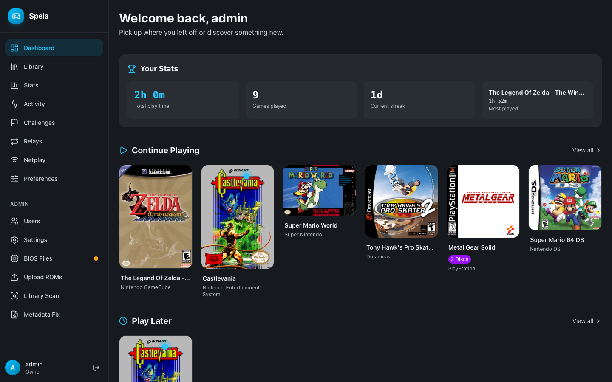
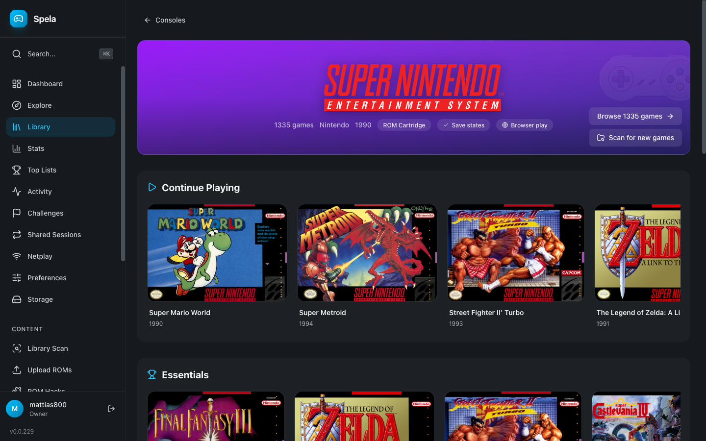
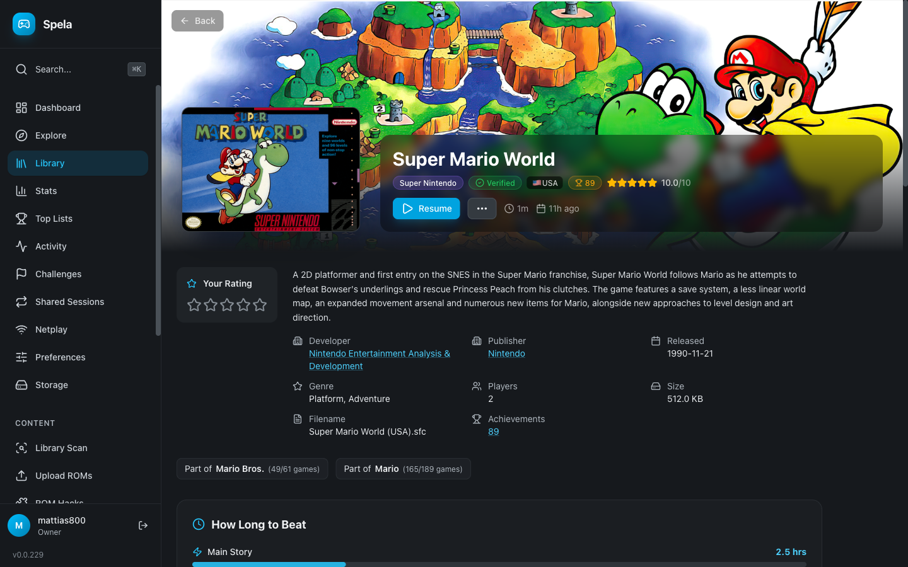
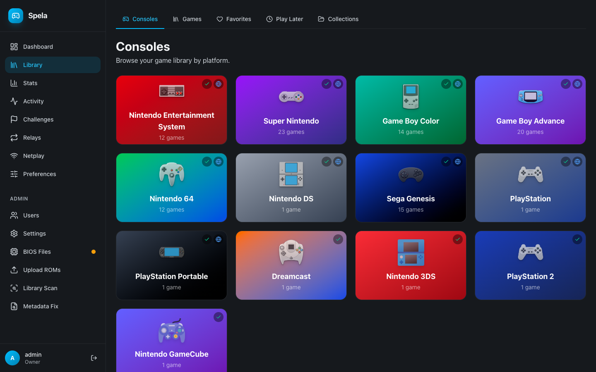

<p align="center">
  <h1 align="center">Spela</h1>
  <p align="center"><em>Nu spelar vi!</em> — Your retro game library, self-hosted. Play anywhere.</p>
</p>

<p align="center">
  <a href="#supported-consoles">35 Consoles</a> &bull;
  <a href="#features">Features</a> &bull;
  <a href="#quick-start">Quick Start</a> &bull;
  <a href="docs/DEPLOY.md">Deploy Guide</a>
</p>

---

Spela is a self-hosted retro game emulation platform. Point it at your ROM collection, and it turns into a beautiful game library with cover art, metadata, cloud saves, multiplayer, and achievements -- accessible from any device.

Think of it as your own personal Steam for retro games.

<p align="center">
  
</p>

<p align="center">
  
  
</p>
<p align="center">
  
</p>

## Why Spela?

- **One library, every device** -- your games, saves, and progress sync across Android, Windows, macOS, and Linux
- **Play in seconds** -- browse your collection with cover art, pick a game, and you're playing. No fiddling with cores or configs
- **Self-hosted** -- your server, your data. Runs on a Raspberry Pi, a NAS, or a VPS. No cloud dependency
- **Multiplayer** -- play with friends via real-time netplay or async turn-based relay sessions
- **Beautiful** -- dark-themed UI designed for browsing large game libraries visually

## Features

### Play Your Way

| Feature | Description |
|---------|-------------|
| **Native Player App** | Kotlin Multiplatform app for Android, Windows, macOS, and Linux with libretro emulation |
| **Browser Play** | Play directly in the web browser via EmulatorJS -- no install needed |
| **Cloud Saves** | Save states sync automatically across all your devices |
| **Shared Saves** | Share your save states publicly for others to download |
| **Auto-Save & Auto-Load** | Never lose progress -- games auto-save on exit and auto-load on start |
| **Visual Shaders** | CRT scanlines, LCD grid, sharp bilinear, and more -- per-console or global |
| **Gamepad Support** | Auto-detected controllers with customizable button mapping, per-console overrides |
| **Fast Forward** | Speed through slow sections with a button press |
| **Screenshots** | Capture in-game screenshots at any time |
| **Performance Overlay** | Optional FPS and frame time display |

### Multiplayer

| Feature | Description |
|---------|-------------|
| **Real-Time Netplay** | Two-player online multiplayer with lockstep input sync. Share a 6-character invite code and play together |
| **Relay Sessions** | Asynchronous turn-based multiplayer -- take turns playing and pass the save to your friend |
| **Relay Invitations** | Invite friends to join relay sessions with turn management and timeout protection |

### Social

| Feature | Description |
|---------|-------------|
| **Activity Feed** | See what your friends are playing, their new favorites, ratings, and achievements |
| **Ratings & Reviews** | Rate games and write reviews. See community averages |
| **Favorites** | Mark your favorite games, synced across devices |
| **Play Later Queue** | Save games for later with custom ordering |
| **Collections** | Create named game lists (public or private) |
| **Play History** | Track time played per game with most-played leaderboards |
| **Online Status** | See who's currently playing and what they're playing |
| **User Profiles** | Public profiles with gaming activity and stats |

### Library Management

| Feature | Description |
|---------|-------------|
| **Auto-Detection** | Point Spela at your ROM folders -- it detects consoles, titles, and file types automatically |
| **Metadata Scraping** | Cover art, descriptions, screenshots, ratings, and developer info pulled from ScreenScraper |
| **Multi-User** | Multiple accounts with admin and user roles. First registered user becomes admin |
| **RetroAchievements** | Link your RetroAchievements account for in-game achievements with progress tracking |
| **Multi-Server** | The player app can connect to multiple Spela servers |

## Supported Consoles

35 systems across 8 families. Each console shows whether it supports **save states** and **browser play** (via EmulatorJS, no install needed).

### Nintendo

| Console | Core | Save States | Browser Play | Extensions |
|---------|------|:-----------:|:------------:|------------|
| NES | Nestopia | :white_check_mark: | :white_check_mark: | `.nes` `.fds` |
| SNES | Snes9x | :white_check_mark: | :white_check_mark: | `.sfc` `.smc` |
| Game Boy | Gambatte | :white_check_mark: | :white_check_mark: | `.gb` |
| Game Boy Color | Gambatte | :white_check_mark: | :white_check_mark: | `.gbc` |
| Game Boy Advance | mGBA | :white_check_mark: | :white_check_mark: | `.gba` |
| Nintendo 64 | Mupen64Plus | :white_check_mark: | :white_check_mark: | `.n64` `.z64` `.v64` |
| Nintendo DS | DeSmuME | :white_check_mark: | :white_check_mark: | `.nds` |
| Virtual Boy | Beetle VB | :white_check_mark: | :white_check_mark: | `.vb` `.vboy` |
| Nintendo 3DS | Citra | :white_check_mark: | | `.3ds` `.cia` |
| Pokemon Mini | PokeMini | :white_check_mark: | | `.min` |

### Sega

| Console | Core | Save States | Browser Play | Extensions |
|---------|------|:-----------:|:------------:|------------|
| Sega Master System | Genesis Plus GX | :white_check_mark: | :white_check_mark: | `.sms` |
| Sega Genesis / Mega Drive | Genesis Plus GX | :white_check_mark: | :white_check_mark: | `.md` `.gen` `.bin` |
| Game Gear | Genesis Plus GX | :white_check_mark: | :white_check_mark: | `.gg` |
| Sega CD | Genesis Plus GX | :white_check_mark: | :white_check_mark: | `.iso` `.bin` `.cue` `.chd` |
| Sega 32X | PicoDrive | :white_check_mark: | :white_check_mark: | `.32x` `.bin` |
| Sega Saturn | Beetle Saturn | :white_check_mark: | :white_check_mark: | `.iso` `.bin/.cue` |
| Dreamcast | Flycast | :white_check_mark: | | `.gdi` `.cdi` `.chd` |

### Sony

| Console | Core | Save States | Browser Play | Extensions |
|---------|------|:-----------:|:------------:|------------|
| PlayStation | Beetle PSX | :white_check_mark: | :white_check_mark: | `.bin/.cue` `.iso` `.pbp` |
| PlayStation 2 | PCSX2 | :white_check_mark: | | `.iso` `.bin` `.chd` |
| PSP | PPSSPP | :white_check_mark: | :white_check_mark: | `.iso` `.cso` |

### Atari

| Console | Core | Save States | Browser Play | Extensions |
|---------|------|:-----------:|:------------:|------------|
| Atari 2600 | Stella | :white_check_mark: | :white_check_mark: | `.a26` `.bin` |
| Atari 5200 | A5200 | :white_check_mark: | :white_check_mark: | `.a52` `.bin` |
| Atari 7800 | ProSystem | :white_check_mark: | :white_check_mark: | `.a78` `.bin` |
| Atari Lynx | Handy | :white_check_mark: | :white_check_mark: | `.lnx` |
| Atari Jaguar | Virtual Jaguar | | :white_check_mark: | `.j64` `.jag` |

### NEC

| Console | Core | Save States | Browser Play | Extensions |
|---------|------|:-----------:|:------------:|------------|
| TurboGrafx-16 | Beetle PCE | :white_check_mark: | :white_check_mark: | `.pce` |
| PC-FX | Beetle PC-FX | :white_check_mark: | :white_check_mark: | `.cue` `.iso` `.chd` |

### SNK

| Console | Core | Save States | Browser Play | Extensions |
|---------|------|:-----------:|:------------:|------------|
| Neo Geo | FBNeo | :white_check_mark: | :white_check_mark: | `.zip` |
| Neo Geo Pocket | Beetle NGP | :white_check_mark: | :white_check_mark: | `.ngp` `.ngc` |

### Other

| Console | Core | Save States | Browser Play | Extensions |
|---------|------|:-----------:|:------------:|------------|
| Arcade (MAME) | MAME 2003+ | :white_check_mark: | :white_check_mark: | `.zip` |
| WonderSwan | Beetle WonderSwan | :white_check_mark: | :white_check_mark: | `.ws` `.wsc` |
| ColecoVision | GearColeco | :white_check_mark: | :white_check_mark: | `.col` `.cv` `.bin` |
| Commodore 64 | VICE | :white_check_mark: | :white_check_mark: | `.d64` `.t64` `.prg` `.crt` |
| Commodore Amiga | PUAE | :white_check_mark: | :white_check_mark: | `.adf` `.hdf` `.ipf` `.lha` `.zip` |
| DOS | DOSBox Pure | :white_check_mark: | :white_check_mark: | `.zip` `.exe` `.com` `.bat` |

## Quick Start

The fastest way to get running is Docker Compose.

### 1. Organize your ROMs

```
games/
  nes/
    Super Mario Bros.nes
  snes/
    Chrono Trigger.sfc
  gba/
    Pokemon Emerald.gba
```

### 2. Generate secrets and configure

```bash
./generate-secrets.sh
```

Edit the generated `.env` file and set `SPELA_GAMES_PATH` to your ROM directory.

### 3. Start Spela

```bash
docker compose up -d
```

### 4. Open the web UI

Go to `http://localhost:8080`, register your first account (it becomes admin), and trigger a library scan from the admin panel.

### 5. Download the player app

Download the player app on your device, point it at your server, and start playing.

---

For production deployment with HTTPS, TURN server, and Portainer, see the **[Deploy Guide](docs/DEPLOY.md)**.

## Tech Stack

| Component | Technology |
|-----------|------------|
| Backend | Go, Gin, GORM, SQLite |
| Web Frontend | React, TypeScript, Vite, Tailwind CSS |
| Player App | Kotlin Multiplatform, Compose Multiplatform, libretro |
| Real-Time | WebSocket |
| Auth | JWT with refresh token rotation |
| TURN Server | coturn (for netplay NAT traversal) |

## Development

See [ARCHITECTURE.md](ARCHITECTURE.md) for the full system design.

```bash
# Backend
cd server && go run ./cmd/server

# Web frontend
cd web && npm install && npm run dev

# Player app
# See player/README.md for build instructions
```

## Acknowledgments

Spela is built with and uses the following open-source projects:

- **[retro-game-console-icons](https://github.com/KyleBing/retro-game-console-icons)** (GPL-3.0) — Console hardware icons
- **[console-logos](https://github.com/PRO100BYTE/console-logos)** — Console logo SVGs by Dan Patrick
- **[Icons8](https://icons8.com)** — GameCube and 3DS console icons
- **[EmulatorJS](https://emulatorjs.org)** (GPL-3.0) — Browser-based emulation frontend
- **[libretro / RetroArch](https://www.libretro.com)** (GPL-3.0) — Emulation API and cores
- **[RetroAchievements](https://retroachievements.org)** — Achievement system for retro games

## License

This project is for personal use. Do not distribute copyrighted ROM files.
